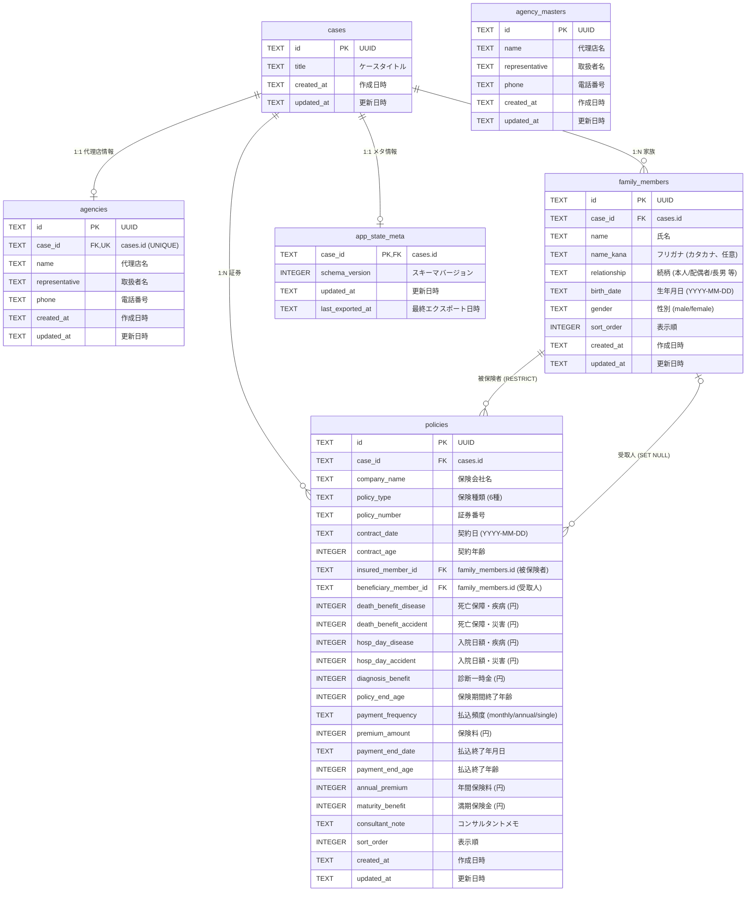

# ER図 — 保険証券分析・診断ダッシュボード

## リレーション一覧

| 親テーブル | 子テーブル | 関係 | FK カラム | 削除時 |
|---|---|---|---|---|
| (独立) | agency_masters | — | — | — |
| cases | agencies | 1:1 | case_id (UNIQUE) | CASCADE |
| cases | family_members | 1:N | case_id | CASCADE |
| cases | policies | 1:N | case_id | CASCADE |
| cases | app_state_meta | 1:1 | case_id | CASCADE |
| family_members | policies | 1:N | insured_member_id | RESTRICT |
| family_members | policies | 0:N | beneficiary_member_id | SET NULL |

## インデックス

| インデックス名 | テーブル | カラム |
|---|---|---|
| idx_family_members_case_id_sort_order | family_members | (case_id, sort_order) |
| idx_policies_case_id_sort_order | policies | (case_id, sort_order) |
| idx_policies_case_id_policy_number | policies | (case_id, policy_number) |
| idx_policies_insured_member_id | policies | (insured_member_id) |
| idx_policies_beneficiary_member_id | policies | (beneficiary_member_id) |

## 制約

- `family_members.gender`: CHECK (`male` or `female`)
- `policies.payment_frequency`: CHECK (`monthly`, `annual`, `single`)
- `agencies.case_id`: UNIQUE (1ケースにつき1代理店)
- 被保険者 (insured_member_id) 削除時は RESTRICT (証券が残っている場合は削除不可)
- 受取人 (beneficiary_member_id) 削除時は SET NULL (証券の受取人を空にする)
